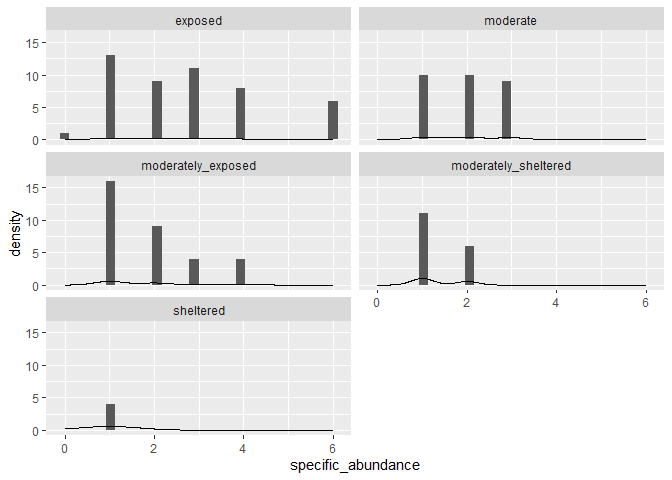

Common Loon Analysis
================
Ellie Gabrielson, Will Draxler, Autumn Pauly

# Background Information

## Introduction

Although Common Loons (Gavia immer) have been studied extensively during
the breeding season not much is known of their behavior on their ocean
wintering grounds, where Loons spend a significant part of their lives
(Bent, 2009). The few studies that do look at winter behavior often
yield conflicting results (McIntyre, 1978; Daub, 1989; Ford and Gieg,
1995). The possible use of different shoreline habitats for activities
such as feeding, sleeping, or taking shelter is worthy of study.
McIntyre (1978) found common loons were semi-social and formed loose
rafts and that loon behavior varied with tides, weather, and time of
day. Daub (1989) and later Ford and Gieg (1995) found refuting evidence
suggesting loons were neither social nor territorial, and did not change
their behavior much by tide. Holm and Burger (2002) found that the
general pattern for loons was that they foraged during slack and
main-flow water. Additionally, the possible difference in dive times as
a result of varying tidal heights is worthy of study. Thompson and Price
(2006) observed that dive times were longer during low tide in
comparison to other tidal stages, though more studies should be
conducted to assess the use of tidal stage and behavior.

Our general hypothesis when analyzing this data is that environmental
conditions affect the behavior of the G. immer. The null hypothesis to
this statement is that environmental conditions do not affect the
behavior of the G. immer.

## Methods

In 2023, observations were conducted at nine established observation
sites along the coastline of Mount Desert Island in Hancock County
(Maine). Observations occurred from January 2023 to March 2023 on a
biweekly basis, where each waterfowl individual was recorded as well as
their behaviors, referencing Daub’s (1989) list of behaviors, and
coordinate location. Locational coordinates were obtained by estimating
the individual’s rough location digitally (accurate to + or - 10 m).
Each transect site was visited for roughly 5-10 minutes, where data
collection followed initial observation. Utilizing a Kestrel 2500,
weather data was recorded accurately to + or - 1°C of temperatures and
within 3% of wind speed. Referencing Daub’s (1989) list of behaviors,
each species’ behavior during the observation was noted. The weather and
environmental data recorded included wind speed and direction,
barometer, cloud cover, precipitation, humidity, temperature, tidal
percentage, and wave class (Beaufort Wind Speed). Tidal data was
gathered from NOAA’s digital tidal charts. This study was repeated in
2024 with the addition of observational variables including species dive
times and tidal height.

# Load Packages and Data

``` r
#install.packages("tidyverse")
library(tidyverse)
```

    ## Warning: package 'tidyverse' was built under R version 4.3.3

    ## Warning: package 'ggplot2' was built under R version 4.3.3

``` r
library(rmarkdown)
library(scales)
```

    ## Warning: package 'scales' was built under R version 4.3.3

``` r
library(ggridges)
```

    ## Warning: package 'ggridges' was built under R version 4.3.3

``` r
library(rstatix)
```

    ## Warning: package 'rstatix' was built under R version 4.3.3

``` r
library(parsnip)
```

    ## Warning: package 'parsnip' was built under R version 4.3.3

``` r
loons_2023 <- read_csv("loon_2023_tidy.csv")
```

    ## Rows: 131 Columns: 34
    ## ── Column specification ────────────────────────────────────────────────────────
    ## Delimiter: ","
    ## chr  (16): tide, cal, location, species, behavior, behavior_notes, sky_condi...
    ## dbl  (16): year, month, day, tide_percentage, number, latitude, longitude, m...
    ## date  (1): date
    ## time  (1): time
    ## 
    ## ℹ Use `spec()` to retrieve the full column specification for this data.
    ## ℹ Specify the column types or set `show_col_types = FALSE` to quiet this message.

``` r
loons_2024 <- read_csv("loon_2024_tidy.csv")
```

    ## Rows: 775 Columns: 31
    ## ── Column specification ────────────────────────────────────────────────────────
    ## Delimiter: ","
    ## chr  (19): date, tide, location, species, latitude, behavior, sex, behavior_...
    ## dbl  (11): number, longitude, meters_offshore, temperature, wind_speed, baro...
    ## time  (1): time
    ## 
    ## ℹ Use `spec()` to retrieve the full column specification for this data.
    ## ℹ Specify the column types or set `show_col_types = FALSE` to quiet this message.

# Tidal Condition and Behavior for 2023 and 2024

Hypothesis: Tidal height has a significant effect on G. immer behavior

Null Hypothesis: Tidal height will not have a significant effect on G.
immer behavior

``` r
# #this is the dataset that we want to sample from? 
# loon_tide_behavior <- loons_2023 %>% 
#   select(behavior, tide)

## Tide-Behavior visualizations - to be moved to analysis
loons_2023 %>% 
  count(behavior, tide) %>% 
  ggplot(aes(x = behavior, y = n)) +
  geom_col() +
  facet_wrap(~ tide) + 
      theme(axis.text.x = element_text(angle = 90, vjust = 0.5, hjust=1))+ 
  labs(title = "Count of Behavior", 
       subtitle = "by Tidal Stage", 
       x = "Behavior", 
       y = "Count")
```

<!-- -->

``` r
#tidal stage count graph
loons_2023 %>% 
  count(tide) %>% 
  ggplot(aes(x = tide, y = n)) +
      geom_col() + 
      theme(axis.text.x = element_text(angle = 90, vjust = 0.5, hjust=1)) + 
  labs(title = "Count of Observations", 
       subtitle = "by Tidal Stage", 
       x = "Tidal Stage", 
       y = "Count")
```

<!-- -->

### Chi-Squared Test of Independence

The Chi-Squared Test of Independence examines whether there is a
relationship between two categorical variables. Our null hypothesis,
that tidal height will not have a significant effect on G. immer
behavior, assumes that tidal condition and behavior are independent. Our
hypothesis, that tidal height will have a significant effect on G. immer
behavior, assumes that tidal condition and behavior are dependent.

#### Expected Frequencies and Contingency Table

Before performing the chi-square test, we need to calculate the expected
frequencies for each cell in the contingency table. These expected
frequencies represent what you would expect to observe if there were no
association between tidal condition and behavior.

``` r
contingency_table1 <- table(loons_2023$tide, loons_2023$behavior)
contingency_table1
```

    ##       
    ##        ASHORE DIVING DRIFTING MAINTENANCE PEERING
    ##   HIGH      0     23        7           2       1
    ##   LOW       1     38       26           1       2
    ##   MID       0     29        0           0       1

#### Chi-square Test

Now that we have the contingency table of expected frequencies, we can
perform the statistical test.

``` r
chi_sq_test1 <- chisq.test(contingency_table1)
```

    ## Warning in chisq.test(contingency_table1): Chi-squared approximation may be
    ## incorrect

``` r
chi_sq_test1
```

    ## 
    ##  Pearson's Chi-squared test
    ## 
    ## data:  contingency_table1
    ## X-squared = 21.276, df = 8, p-value = 0.006449

``` r
# # x-squared
# chi_sq_test1$statistic
# 
# #p-value
# chi_sq_test1$p.value
# 
# #expected frequencies
# chi_sq_test1$expected
```

REPORT: The behavior of Common Loons is dependent on tidal condition
(Pearson’s Chi-squared test; X-squared = 33.184, df = 10, p-value \>
0.005).

``` r
# install.packages("summarytools")
# library(summarytools)
# library(dplyr)
# 
# # fourth method:
# loons_2023 %$%
#   ctable(tide, behavior,
#     prop = "r", chisq = TRUE, headings = FALSE
#   ) %>%
#   print(
#     method = "render",
#     style = "rmarkdown",
#     footnote = NA
#   )
```

<!-- #### ANOVA -->
<!-- If we want to compare the abundance of diving behavior between the three tidal stages (high tide, mid tide, and low tide), we need to compare the means of a count variable (number of diving behaviors) across different groups (tidal stages). ANOVA is suitable for comparing means across multiple groups, which makes it appropriate for this scenario. -->
<!-- ```{r} -->
<!-- loon_2023_diving <- loons_2023 %>% -->
<!--   select(species, behavior, date, tide, overall_abundance, specific_abundance) %>% -->
<!--   filter(species == "COMMON LOON") %>% -->
<!--   mutate(behavior = if_else(behavior == "DIVING", "diving", "other")) %>% -->
<!--   group_by(date, overall_abundance, tide) %>% -->
<!--   count(behavior) %>% -->
<!--   mutate(diving_count = n) -->
<!-- loon_2023_diving <-loon_2023_diving %>% -->
<!--   filter(behavior == "diving") %>% -->
<!--   mutate(diving_percentage = diving_count/overall_abundance) -->
<!-- ``` -->
<!-- Running an ANOVA test -->
<!-- ```{r} -->
<!-- # Perform ANOVA -->
<!-- anova_model1 <- aov(diving_percentage ~ tide, data = loon_2023_diving) -->
<!-- summary(anova_model1) -->
<!-- # Perform Tukey's HSD test for pairwise comparisons -->
<!-- tukey_results1 <- TukeyHSD(anova_model1) -->
<!-- print(tukey_results1) -->
<!-- ``` -->
<!-- REPORT: -->

# Tidal Conditions and Dive Times - 2024

Hypothesis: Low tide will cause G. immer to have significantly longer
dive times.

Null Hypothesis: Low tide will not cause G. immer to have significantly
longer dive times.

### Data Tidying

``` r
library(stringr)
library(ggpubr)
```

    ## Warning: package 'ggpubr' was built under R version 4.3.3

``` r
# install.packages("moments")
# library(moments)

loons_dive_2024 <- loons_2024 %>% 
  filter(species == "common_loon") %>% 
  select(tide, behavior, dive_time_obs, tidal_height) %>% 
  filter(dive_time_obs != "n/a") %>% 
  filter(dive_time_obs != "na")

loons_dive_2024 <- loons_dive_2024 %>% 
  separate_longer_delim(dive_time_obs, delim = ",")

loons_dive_2024 <- loons_dive_2024 %>%
  mutate(dive_time_obs = as.numeric(dive_time_obs))

loons_dive_2024 <- loons_dive_2024 %>% 
  mutate(general_tide = fct_recode(tide, "low" = "low_flood", 
                           "low" = "low_slack",
                           "mid" = "mid_flood",
                           "mid" = "mid_ebb",
                           "high" = "high_flood",
                           "high" = "high_slack",
                           "high" = "high_ebb"))
```

### Randomly Sampling

``` r
library(tidymodels)
```

    ## Warning: package 'tidymodels' was built under R version 4.3.3

    ## ── Attaching packages ────────────────────────────────────── tidymodels 1.1.1 ──

    ## ✔ broom        1.0.5      ✔ rsample      1.2.0 
    ## ✔ dials        1.2.1      ✔ tune         1.1.2 
    ## ✔ infer        1.0.6      ✔ workflows    1.1.4 
    ## ✔ modeldata    1.3.0      ✔ workflowsets 1.0.1 
    ## ✔ recipes      1.0.10     ✔ yardstick    1.3.0

    ## Warning: package 'dials' was built under R version 4.3.3

    ## Warning: package 'infer' was built under R version 4.3.3

    ## Warning: package 'modeldata' was built under R version 4.3.3

    ## Warning: package 'recipes' was built under R version 4.3.3

    ## Warning: package 'rsample' was built under R version 4.3.3

    ## Warning: package 'tune' was built under R version 4.3.3

    ## Warning: package 'workflows' was built under R version 4.3.3

    ## Warning: package 'workflowsets' was built under R version 4.3.3

    ## Warning: package 'yardstick' was built under R version 4.3.3

    ## ── Conflicts ───────────────────────────────────────── tidymodels_conflicts() ──
    ## ✖ infer::chisq_test() masks rstatix::chisq_test()
    ## ✖ scales::discard()   masks purrr::discard()
    ## ✖ rstatix::filter()   masks dplyr::filter(), stats::filter()
    ## ✖ recipes::fixed()    masks stringr::fixed()
    ## ✖ dials::get_n()      masks rstatix::get_n()
    ## ✖ dplyr::lag()        masks stats::lag()
    ## ✖ infer::prop_test()  masks rstatix::prop_test()
    ## ✖ yardstick::spec()   masks readr::spec()
    ## ✖ recipes::step()     masks stats::step()
    ## ✖ infer::t_test()     masks rstatix::t_test()
    ## • Use suppressPackageStartupMessages() to eliminate package startup messages

``` r
#low tide
loons_lowdive_2024 <- loons_dive_2024 %>% 
  filter(general_tide == "low") %>% 
  select(dive_time_obs)

set.seed(101)

sampled_low <- loons_lowdive_2024 %>%
  specify(response = dive_time_obs) %>% 
  generate(reps = 1000, type = "bootstrap") %>% 
  calculate(stat = "mean")

sampled_low <- sampled_low %>% 
  mutate(replicate = as.character(replicate)) %>% 
  mutate(tide = if_else(replicate != 0, "low", replicate)) %>% 
  select(tide, stat)

#mid tide
loons_middive_2024 <- loons_dive_2024 %>% 
  filter(general_tide == "mid") %>% 
  select(dive_time_obs)

set.seed(101)

sampled_mid <- loons_middive_2024 %>%
  specify(response = dive_time_obs) %>% 
  generate(reps = 1000, type = "bootstrap") %>% 
  calculate(stat = "mean")

sampled_mid <- sampled_mid %>% 
  mutate(replicate = as.character(replicate)) %>% 
  mutate(tide = if_else(replicate != 0, "mid", replicate)) %>% 
  select(tide, stat)

#high tide
loons_highdive_2024 <- loons_dive_2024 %>% 
  filter(general_tide == "high") %>% 
  select(dive_time_obs)

set.seed(101)

sampled_high <- loons_highdive_2024 %>%
  specify(response = dive_time_obs) %>% 
  generate(reps = 1000, type = "bootstrap") %>% 
  calculate(stat = "mean")

sampled_high <- sampled_high %>% 
  mutate(replicate = as.character(replicate)) %>% 
  mutate(tide = if_else(replicate != 0, "high", replicate)) %>% 
  select(tide, stat)

#joining dataset
dive_samples <- rbind(sampled_low, sampled_high)
dive_samples <- rbind(dive_samples, sampled_mid)
```

### Visualizations

``` r
ggplot(data = dive_samples, mapping = aes(x = stat)) + 
  geom_histogram() + 
  facet_wrap(~tide, ncol = 1) + 
  theme_minimal() +
  labs(title = "Dive Times of Common Loons", 
       subtitle = "during low, mid, and high tide", 
       x = "Dive Time (seconds)", 
       y = "Count")
```

    ## `stat_bin()` using `bins = 30`. Pick better value with `binwidth`.

<!-- -->

Below we are visualizing dive times in the form of a boxplot.

``` r
dive_samples$tide <- fct_relevel(dive_samples$tide, c("low", "mid", "high"))

ggplot(data = dive_samples, mapping = aes(x = tide, y = stat)) + 
  geom_boxplot() +
  labs(title = "Tidal Conditions and Dive Times", 
       subtitle = "of Gavia immer", 
       x = "Tidal Stage", 
       y = "Dive Time (seconds)")
```

<!-- -->

### Statistics

``` r
diveaov = aov(stat ~ tide, data = dive_samples)
summary(diveaov)
```

    ##               Df Sum Sq Mean Sq F value Pr(>F)    
    ## tide           2 151665   75832    5713 <2e-16 ***
    ## Residuals   2997  39781      13                   
    ## ---
    ## Signif. codes:  0 '***' 0.001 '**' 0.01 '*' 0.05 '.' 0.1 ' ' 1

``` r
TukeyHSD(diveaov)
```

    ##   Tukey multiple comparisons of means
    ##     95% family-wise confidence level
    ## 
    ## Fit: aov(formula = stat ~ tide, data = dive_samples)
    ## 
    ## $tide
    ##                diff        lwr        upr p adj
    ## mid-low  -17.058500 -17.440558 -16.676442     0
    ## high-low  -5.487406  -5.869464  -5.105348     0
    ## high-mid  11.571094  11.189036  11.953152     0

``` r
#high to low
loons_dive_2024_1 <- dive_samples %>%
  filter(tide == "high"|tide == "mid")

t.test(stat ~ tide, data = loons_dive_2024_1)
```

    ## 
    ##  Welch Two Sample t-test
    ## 
    ## data:  stat by tide
    ## t = -77.381, df = 1212, p-value < 2.2e-16
    ## alternative hypothesis: true difference in means between group mid and group high is not equal to 0
    ## 95 percent confidence interval:
    ##  -11.86447 -11.27772
    ## sample estimates:
    ##  mean in group mid mean in group high 
    ##           30.39510           41.96619

``` r
#low to high
loons_dive_2024_1 <- dive_samples %>%
  filter(tide == "high"|tide == "low")

t.test(stat ~ tide, data = loons_dive_2024_1)
```

    ## 
    ##  Welch Two Sample t-test
    ## 
    ## data:  stat by tide
    ## t = 39.158, df = 1244.3, p-value < 2.2e-16
    ## alternative hypothesis: true difference in means between group low and group high is not equal to 0
    ## 95 percent confidence interval:
    ##  5.212480 5.762331
    ## sample estimates:
    ##  mean in group low mean in group high 
    ##           47.45360           41.96619

``` r
#low to mid
loons_dive_2024_1 <- dive_samples %>%
  filter(tide == "mid"|tide == "low")

t.test(stat ~ tide, data = loons_dive_2024_1)
```

    ## 
    ##  Welch Two Sample t-test
    ## 
    ## data:  stat by tide
    ## t = 87.921, df = 1987.6, p-value < 2.2e-16
    ## alternative hypothesis: true difference in means between group low and group mid is not equal to 0
    ## 95 percent confidence interval:
    ##  16.678 17.439
    ## sample estimates:
    ## mean in group low mean in group mid 
    ##           47.4536           30.3951

REPORT: The dive times of Common Loons were significantly longer during
high tide in comparison to dives during mid tide (Welch’s Two Sample
t-test; t = 77.381, df = 1212, p-value \< 0.0005). The average dive time
during high tide was 41.97 seconds. The average dive time during mid
tide was 30.4 seconds.

REPORT: The dive times of Common Loons were significantly longer during
low tide in comparison to dives during high tide (Welch’s Two Sample
t-test; t = -39.158, df = 1244.3, p-value \< 0.0005). The average dive
time during low tide was 47.45 seconds. The average dive time during
high tide was 41.97 seconds.

REPORT: The dive times of Common Loons were significantly longer during
low tide in comparison to dives during mid tide (Welch’s Two Sample
t-test; t = 87.921, df = 1987.6, p-value \< 0.0005). The average dive
time during low tide was 47.45 seconds. The average dive time during mid
tide was 30.4 seconds.

# Exposure Level and Abundance - 2023

Hypothesis: Higher exposure level of location significantly positively
affects G. immer presence.

Null Hypothesis: Higher exposure level of location will not
significantly positively affect G. immer presence.

Predictor variable = categorical outcome variable = quantitative test =
ANOVA

``` r
loons_2023 %>% 
  ggplot(mapping = aes(x = shelter_gradient, y = specific_abundance)) + 
  geom_boxplot() +
  labs(title = "Common Loon Abundance", 
       subtitle = "by Shelter Gradient", 
       x = "Shelter Gradient", 
       y = "Abundance")
```

<!-- -->

``` r
loons_2023 %>% 
  ggplot(mapping = aes(x = specific_abundance)) +
  geom_histogram() +
  geom_density() + 
  facet_wrap(~shelter_gradient, ncol = 2)
```

    ## `stat_bin()` using `bins = 30`. Pick better value with `binwidth`.

<!-- -->

``` r
#plot
loons_2023 %>% 
  ggplot(aes(x = specific_abundance, y = shelter_gradient, fill = shelter_gradient)) + 
  geom_density_ridges(alpha = 0.6, bins = 1) + 
  theme_ridges() + 
   theme(legend.position = "none", panel.spacing = unit(0.1, "lines"),
      strip.text.x = element_text(size = 8))+
  theme_minimal() +
  scale_fill_viridis_d() +
  labs(title = "Common Loon Abundance", 
       subtitle = "by Shelter Gradient", 
       x = "Abundance", 
       y = "Shelter Gradient", 
       fill = "Shelter Gradient")
```

    ## Warning in geom_density_ridges(alpha = 0.6, bins = 1): Ignoring unknown
    ## parameters: `bins`

    ## Picking joint bandwidth of 0.467

<!-- -->

``` r
abundanceexposureaov = aov(specific_abundance ~ shelter_gradient, data = loons_2023)
summary(abundanceexposureaov)
```

    ##                   Df Sum Sq Mean Sq F value   Pr(>F)    
    ## shelter_gradient   4  36.68   9.171   6.167 0.000145 ***
    ## Residuals        126 187.36   1.487                     
    ## ---
    ## Signif. codes:  0 '***' 0.001 '**' 0.01 '*' 0.05 '.' 0.1 ' ' 1

``` r
TukeyHSD(abundanceexposureaov)
```

    ##   Tukey multiple comparisons of means
    ##     95% family-wise confidence level
    ## 
    ## Fit: aov(formula = specific_abundance ~ shelter_gradient, data = loons_2023)
    ## 
    ## $shelter_gradient
    ##                                                diff        lwr          upr
    ## moderate-exposed                        -0.78448276 -1.5782588  0.009293261
    ## moderately_exposed-exposed              -0.87121212 -1.6344100 -0.108014250
    ## moderately_sheltered-exposed            -1.39705882 -2.3496002 -0.444517493
    ## sheltered-exposed                       -1.75000000 -3.5063994  0.006399428
    ## moderately_exposed-moderate             -0.08672936 -0.9457668  0.772308103
    ## moderately_sheltered-moderate           -0.61257606 -1.6435025  0.418350393
    ## sheltered-moderate                      -0.96551724 -2.7656321  0.834597568
    ## moderately_sheltered-moderately_exposed -0.52584670 -1.5334180  0.481724627
    ## sheltered-moderately_exposed            -0.87878788 -2.6656298  0.908054014
    ## sheltered-moderately_sheltered          -0.35294118 -2.2284859  1.522603529
    ##                                             p adj
    ## moderate-exposed                        0.0543970
    ## moderately_exposed-exposed              0.0166513
    ## moderately_sheltered-exposed            0.0008059
    ## sheltered-exposed                       0.0513347
    ## moderately_exposed-moderate             0.9986485
    ## moderately_sheltered-moderate           0.4720480
    ## sheltered-moderate                      0.5744390
    ## moderately_sheltered-moderately_exposed 0.6002795
    ## sheltered-moderately_exposed            0.6535007
    ## sheltered-moderately_sheltered          0.9851163

REPORT: An Analysis of Variance test demonstrated that coastal exposure
level has a significant effect on the abundance of G. immer (ANOVA,
F_4,126 = 6.167; p = 0.000145). An unplanned analytical comparison
demonstrated that G. immer presence \[finish this\].

# Exposure Level and Behavior

Hypothesis: Exposure level of location significantly impacts G. immer
behavior.

Null Hypothesis: Exposure level of location has no significant impact on
G. immer behavior.

``` r
loons_2023 %>% 
  count(behavior, shelter_gradient) %>% 
  ggplot(aes(x = behavior, y = n)) +
  geom_col(fill = "firebrick4", color = "black") +
  facet_wrap(~ shelter_gradient, nrow = 1) + 
  theme(axis.text.x = element_text(angle = 90, vjust = 0.5, hjust=1)) +
  labs(title = "Count of Common Loon Behavior", 
       subtitle = "by Shelter Gradient", 
       x = "Behavior", 
       y = "Count")
```

<!-- -->

``` r
behavior_exposure_kruskal <- kruskal.test(behavior ~ shelter_gradient, data = loons_2023)
behavior_exposure_kruskal
```

    ## 
    ##  Kruskal-Wallis rank sum test
    ## 
    ## data:  behavior by shelter_gradient
    ## Kruskal-Wallis chi-squared = 7.741, df = 4, p-value = 0.1015

``` r
behavior_exposure_dunn <- loons_2023 %>% dunn_test(behavior ~ shelter_gradient, p.adjust.method = "bonferroni")
behavior_exposure_dunn
```

    ## # A tibble: 10 × 9
    ##    .y.      group1        group2    n1    n2 statistic      p p.adj p.adj.signif
    ##  * <chr>    <chr>         <chr>  <int> <int>     <dbl>  <dbl> <dbl> <chr>       
    ##  1 behavior exposed       moder…    48    29    -0.376 0.707  1     ns          
    ##  2 behavior exposed       moder…    48    33     2.06  0.0389 0.389 ns          
    ##  3 behavior exposed       moder…    48    17     0.793 0.428  1     ns          
    ##  4 behavior exposed       shelt…    48     4    -1.00  0.317  1     ns          
    ##  5 behavior moderate      moder…    29    33     2.18  0.0291 0.291 ns          
    ##  6 behavior moderate      moder…    29    17     1.02  0.307  1     ns          
    ##  7 behavior moderate      shelt…    29     4    -0.811 0.417  1     ns          
    ##  8 behavior moderately_e… moder…    33    17    -0.815 0.415  1     ns          
    ##  9 behavior moderately_e… shelt…    33     4    -1.87  0.0620 0.620 ns          
    ## 10 behavior moderately_s… shelt…    17     4    -1.34  0.180  1     ns

### REPORT

\#Wave Class and Behavior

Hypothesis: Wave class will significantly affect G. immer behavior.

Null Hypothesis: Wave class will not significantly affect G. immer
behavior.

``` r
loons_2023 %>% 
 ggplot(aes(x = wave_class)) +
  geom_histogram() +
  facet_wrap(~ behavior, nrow = 1)
```

    ## `stat_bin()` using `bins = 30`. Pick better value with `binwidth`.

<!-- -->

``` r
loons_2023 %>%
  ggplot(aes(x = wave_class, y = behavior, fill = behavior)) + 
  geom_density_ridges(alpha = 0.6, bins = 1)
```

    ## Warning in geom_density_ridges(alpha = 0.6, bins = 1): Ignoring unknown
    ## parameters: `bins`

    ## Picking joint bandwidth of 0.244

<!-- -->

``` r
waveclassaov = aov(wave_class ~ behavior, data = loons_2023)
summary(waveclassaov)
```

    ##              Df Sum Sq Mean Sq F value Pr(>F)  
    ## behavior      4   4.79  1.1975   2.356 0.0572 .
    ## Residuals   126  64.05  0.5083                 
    ## ---
    ## Signif. codes:  0 '***' 0.001 '**' 0.01 '*' 0.05 '.' 0.1 ' ' 1

Wave class did not significantly affect G. immer behavior (one-way
ANOVA, F_4,126 = 2.356, P = 0.0572).

\#Meters Offshore and Dive Times

Hypothesis: Distance from shore will significantly affect G. immer dive
times.

Null Hypothesis: Distance from shore will not significantly affect G.
immer dive times.

``` r
loons_dive_2024 <- loons_2024 %>% 
  filter(species == "common_loon") %>% 
  select(tide, behavior, dive_time_obs, tidal_height, meters_offshore) %>% 
  filter(dive_time_obs != "n/a") %>% 
  filter(dive_time_obs != "na")

loons_dive_2024 <- loons_dive_2024 %>% 
  separate_longer_delim(dive_time_obs, delim = ",") %>% 
  mutate(dive_time_obs = as.numeric(dive_time_obs))

loons_dive_2024 %>% 
  ggplot(aes(x = meters_offshore, y = dive_time_obs)) + 
  geom_jitter() + 
  geom_smooth(method = "lm")
```

    ## `geom_smooth()` using formula = 'y ~ x'

    ## Warning: Removed 2 rows containing non-finite outside the scale range
    ## (`stat_smooth()`).

    ## Warning: Removed 2 rows containing missing values or values outside the scale range
    ## (`geom_point()`).

<!-- -->

``` r
#linear model
loon.dive.meters.lm <- lm(dive_time_obs ~ meters_offshore, data = loons_dive_2024)

summary(loon.dive.meters.lm)
```

    ## 
    ## Call:
    ## lm(formula = dive_time_obs ~ meters_offshore, data = loons_dive_2024)
    ## 
    ## Residuals:
    ##     Min      1Q  Median      3Q     Max 
    ## -31.472  -7.373   1.128   8.527  26.728 
    ## 
    ## Coefficients:
    ##                 Estimate Std. Error t value Pr(>|t|)    
    ## (Intercept)     33.67113    2.10711  15.980  < 2e-16 ***
    ## meters_offshore  0.36003    0.06827   5.274  9.3e-07 ***
    ## ---
    ## Signif. codes:  0 '***' 0.001 '**' 0.01 '*' 0.05 '.' 0.1 ' ' 1
    ## 
    ## Residual standard error: 13.07 on 89 degrees of freedom
    ##   (2 observations deleted due to missingness)
    ## Multiple R-squared:  0.2381, Adjusted R-squared:  0.2295 
    ## F-statistic: 27.81 on 1 and 89 DF,  p-value: 9.298e-07

A linear model demonstrated a significant positive relationship between
dive time and meters off shore (F1,89 = 27.81 : p = \<0.5). 24% of the
total variability in dive time can be predicted through a knowledge of
meters off shore.

\#Tidal height and dive times

Hypothesis: Tidal height will significantly affect G. immer dive times.

Null Hypothesis: Tidal height will not significantly affect G. immer
dive times.

``` r
loons_dive_2024 %>% 
  ggplot(aes(x = tidal_height, y = dive_time_obs)) + 
  geom_point() +
  geom_smooth(method = "lm")
```

    ## `geom_smooth()` using formula = 'y ~ x'

    ## Warning: Removed 3 rows containing non-finite outside the scale range
    ## (`stat_smooth()`).

    ## Warning: Removed 3 rows containing missing values or values outside the scale range
    ## (`geom_point()`).

<!-- -->

``` r
dive_time_tide_height_lm <- lm(dive_time_obs ~ tidal_height, data = loons_dive_2024)
summary(dive_time_tide_height_lm)
```

    ## 
    ## Call:
    ## lm(formula = dive_time_obs ~ tidal_height, data = loons_dive_2024)
    ## 
    ## Residuals:
    ##     Min      1Q  Median      3Q     Max 
    ## -32.224  -9.935  -0.204   9.611  36.985 
    ## 
    ## Coefficients:
    ##              Estimate Std. Error t value Pr(>|t|)    
    ## (Intercept)  41.00240    2.49655  16.424   <2e-16 ***
    ## tidal_height  0.05531    0.46486   0.119    0.906    
    ## ---
    ## Signif. codes:  0 '***' 0.001 '**' 0.01 '*' 0.05 '.' 0.1 ' ' 1
    ## 
    ## Residual standard error: 14.48 on 88 degrees of freedom
    ##   (3 observations deleted due to missingness)
    ## Multiple R-squared:  0.0001609,  Adjusted R-squared:  -0.0112 
    ## F-statistic: 0.01416 on 1 and 88 DF,  p-value: 0.9056

``` r
#This is actually so interesting
```

A linear model demonstrated no significant relationship between dive
time and tidal height (F1,88 = 0.014 : p = 0.91).

\#Tidal classification and dive times

Hypothesis: Tidal class will significantly affect G. immer dive times.

Null Hypothesis: Tidal class will not significantly affect G. immer dive
times.

``` r
loons_dive_2024$tide <- fct_relevel(loons_dive_2024$tide, c("mid_ebb",
                                                            "low_slack",
                                                            "low_flood",
                                                            "mid_flood",
                                                            "high_flood",
                                                            "high_slack",
                                                            "high_ebb"))
loons_dive_2024 %>% 
ggplot(mapping = aes(x = tide, y = dive_time_obs)) + 
  geom_boxplot()
```

<!-- -->

``` r
full_tide_aov = aov(dive_time_obs ~ tide, data = loons_dive_2024)
summary(full_tide_aov)
```

    ##             Df Sum Sq Mean Sq F value   Pr(>F)    
    ## tide         6   4884     814   4.599 0.000427 ***
    ## Residuals   86  15220     177                     
    ## ---
    ## Signif. codes:  0 '***' 0.001 '**' 0.01 '*' 0.05 '.' 0.1 ' ' 1

``` r
TukeyHSD(full_tide_aov)
```

    ##   Tukey multiple comparisons of means
    ##     95% family-wise confidence level
    ## 
    ## Fit: aov(formula = dive_time_obs ~ tide, data = loons_dive_2024)
    ## 
    ## $tide
    ##                              diff        lwr        upr     p adj
    ## low_slack-mid_ebb      27.4772727   8.813496 46.1410497 0.0005055
    ## low_flood-mid_ebb      15.6388889  -3.878526 35.1563034 0.2033536
    ## mid_flood-mid_ebb      26.7500000  -5.004412 58.5044124 0.1571289
    ## high_flood-mid_ebb     11.9654545  -6.698322 30.6292315 0.4629341
    ## high_slack-mid_ebb     14.3166667  -1.666037 30.2993704 0.1095394
    ## high_ebb-mid_ebb       22.5227273   5.939526 39.1059283 0.0017457
    ## low_flood-low_slack   -11.8383838 -29.891886  6.2151188 0.4348736
    ## mid_flood-low_slack    -0.7272727 -31.603513 30.1489673 1.0000000
    ## high_flood-low_slack  -15.5118182 -32.638875  1.6152382 0.1021039
    ## high_slack-low_slack  -13.1606061 -27.318512  0.9973001 0.0858958
    ## high_ebb-low_slack     -4.9545455 -19.787011  9.8779205 0.9507456
    ## mid_flood-low_flood    11.1111111 -20.288492 42.5107145 0.9355904
    ## high_flood-low_flood   -3.6734343 -21.726937 14.3800683 0.9961944
    ## high_slack-low_flood   -1.3222222 -16.587844 13.9433994 0.9999721
    ## high_ebb-low_flood      6.8838384  -9.009397 22.7770741 0.8465552
    ## high_flood-mid_flood  -14.7845455 -45.660785 16.0916945 0.7753709
    ## high_slack-mid_flood  -12.4333333 -41.766803 16.9001364 0.8593207
    ## high_ebb-mid_flood     -4.2272727 -33.892205 25.4376591 0.9994892
    ## high_slack-high_flood   2.3512121 -11.806694 16.5091183 0.9987762
    ## high_ebb-high_flood    10.5572727  -4.275193 25.3897387 0.3341765
    ## high_ebb-high_slack     8.2060606  -3.068348 19.4804694 0.3077188

An Analysis of Variance test demonstrated that tidal class has a
significant effect on the length of G. immer dive times (ANOVA, F_6,86 =
4.599; p = 0.000427). An uplanned analytical comparison demonstrated
that G. immer dive times at low slack tide were signficantly different
than those at mid ebb tide (TukeyB, p \< 0.0005055), and dive lengths at
high ebb tide were significantly different than those at mid ebb tide
(TukeyB, p = 0.0017457). Otherwise, there were no significant
differences in dive times between other tidal classes (TukeyB, p \>
0.05)

# Discussion / Conclusion

# Citations

Bent, A. C. 2009. Life Histories of North American Diving Birds. Cornell
University Press: Ithaca, New York.

Daub, B. C. 1989. Behavior of Common Loons in Winter. Journal of Field
Ornithology 60: 305-311.

Ford, T. B. and Gieg, J. A. 1995. Winter Behavior of the Common Loon.
Journal of Field Ornithology 66: 22-29.

McIntyre, J. W. 1978. Wintering Behavior of Common Loons. The Auk 95:
396-403.

Holm, K. and Burger, A. 2002. Foraging Behavior and Resource
Partitioning by Diving Birds During Winter in Areas of Strong Tidal
Currents. Waterbirds 25(3): 312-325.

Thompson, Stephanie A. & Price, J. J. (2006). Water Clarity and Diving
Behavior in Wintering Common Loons. Waterbirds: The International
Journal of Waterbird Biology, 29(2), 169–175.
