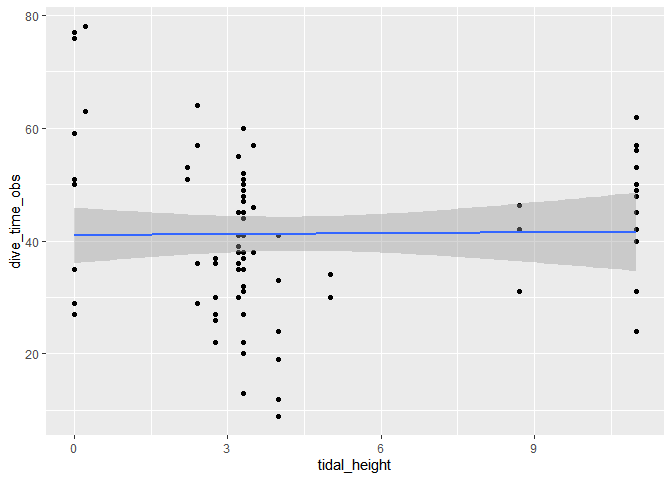

Common Loon Analysis
================
Ellie Gabrielson, Will Draxler, Autumn Pauly

# Background Information

# Load Packages and Data

``` r
#install.packages("tidyverse")
library(tidyverse)
library(rmarkdown)
library(scales)
library(ggridges)
```

    ## Warning: package 'ggridges' was built under R version 4.3.3

``` r
library(rstatix)
```

    ## Warning: package 'rstatix' was built under R version 4.3.3

``` r
library(parsnip)
```

    ## Warning: package 'parsnip' was built under R version 4.3.3

``` r
loons_2023 <- read_csv("loons_2023.csv")
```

    ## Rows: 131 Columns: 31
    ## ── Column specification ────────────────────────────────────────────────────────
    ## Delimiter: ","
    ## chr  (16): tide, cal, location, species, behavior, behavior_notes, sky_condi...
    ## dbl  (13): tide_percentage, number, latitude, longitude, meters_offshore, te...
    ## date  (1): date
    ## time  (1): time
    ## 
    ## ℹ Use `spec()` to retrieve the full column specification for this data.
    ## ℹ Specify the column types or set `show_col_types = FALSE` to quiet this message.

``` r
loons_2024 <- read_csv("loons_2024.csv")
```

    ## Rows: 775 Columns: 31
    ## ── Column specification ────────────────────────────────────────────────────────
    ## Delimiter: ","
    ## chr  (19): date, tide, location, species, latitude, behavior, sex, behavior_...
    ## dbl  (11): number, longitude, meters_offshore, temperature, wind_speed, baro...
    ## time  (1): time
    ## 
    ## ℹ Use `spec()` to retrieve the full column specification for this data.
    ## ℹ Specify the column types or set `show_col_types = FALSE` to quiet this message.

We should bootstrap all of the tidal heights so that we have equal
observations… maybe not?

``` r
#boot_loon_2023 <- loons_2023_behavior %>% 
 # specify(response = behavior) %>% 
 # generate(reps = 15000, type = "bootstrap")
```

# Tidal Condition and Behavior for 2023 and 2024

Hypothesis: Tidal height has a significant effect on G. immer behavior

Null Hypothesis: Tidal height will not have a significant effect on G.
immer behavior

### Bootstrapping

``` r
# #download packages
# library(boot)
# 
# #this is the dataset that we want to sample from? 
# loon_tide_behavior <- loons_2023 %>% 
#   select(behavior, tide)
# 
# #function to obtain R-Squared from the data 
# rsq <- function(formula, data, indices)
# {
#   d <- data[indices,] # allows boot to select sample
#   fit <- lm(formula, data=d)
#   return(summary(fit)$r.square)
# } 
# 
# # bootstrapping with 1000 replications
# #loon_results <- boot(data=loon_tide_behavior, statistic=rsq,
#    #R=100, formula=behavior~tide)
# 
# # view results
# #loon_results
# #plot(loon_results)
# 
# # get 95% confidence interval
# #boot.ci(loon_results, type="bca")
```

``` r
#this is the dataset that we want to sample from? 
loon_tide_behavior <- loons_2023 %>% 
  select(behavior, tide)

## Tide-Behavior visualizations - to be moved to analysis
loons_2023 %>% 
  count(behavior, tide) %>% 
  ggplot(aes(x = behavior, y = n)) +
  geom_col() +
  facet_wrap(~ tide) + 
      theme(axis.text.x = element_text(angle = 90, vjust = 0.5, hjust=1))+ 
  labs(title = "Count of Behavior", 
       subtitle = "by Tidal Stage", 
       x = "Behavior", 
       y = "Count")
```

<!-- -->

``` r
#tidal stage count graph
loons_2023 %>% 
  count(tide) %>% 
  ggplot(aes(x = tide, y = n)) +
      geom_col() + 
      theme(axis.text.x = element_text(angle = 90, vjust = 0.5, hjust=1)) + 
  labs(title = "Count of Observations", 
       subtitle = "by Tidal Stage", 
       x = "Tidal Stage", 
       y = "Count")
```

<!-- -->

We need to use a non-parametric test. Kruskal-Wallace

``` r
#1 Tidal Condition and Behavior - 2024/2023

#Behavior_tide_ANOVA <- aov(meters_offshore ~ tide, data = loons_2023)
#summary(Behavior_tide_ANOVA)
```

### Kruskal-Wallis Test

A Kruskal-Wallis test is non-parametric method (a one-way ANOVA on
ranks) to \[insert more here\]. Even though our sample sizes are
different, we will still be able to use this test, as this test allows
for independent samples that have equal or differing sample sizes.

``` r
kw <- kruskal.test(behavior ~ tide, data = loons_2023)
kw
```

    ## 
    ##  Kruskal-Wallis rank sum test
    ## 
    ## data:  behavior by tide
    ## Kruskal-Wallis chi-squared = 12.324, df = 2, p-value = 0.002109

REPORT: The behavior of G. immer was significantly different at various
tidal heights (Kruskal-Wallis chi-squared = 12.324, df = 2, p-value =
0.002109).

### Dunn Test

We now need to use the Dunn test to determine which groups are
different.

``` r
#install packages
# install.packages("ggpubr")
# library(ggpubr)
 install.packages("rstatix")
```

    ## Warning: package 'rstatix' is in use and will not be installed

``` r
 library(rstatix)

ggplot(data = loons_2023, mapping = aes(x = tide, y = ))
```

<!-- -->

``` r
#dunn test
dtkw <- loons_2023 %>% dunn_test(behavior ~ tide, p.adjust.method = "bonferroni")
dtkw
```

    ## # A tibble: 3 × 9
    ##   .y.      group1 group2    n1    n2 statistic        p   p.adj p.adj.signif
    ## * <chr>    <chr>  <chr>  <int> <int>     <dbl>    <dbl>   <dbl> <chr>       
    ## 1 behavior HIGH   LOW       33    68     0.929 0.353    1       ns          
    ## 2 behavior HIGH   MID       33    30    -2.26  0.0236   0.0707  ns          
    ## 3 behavior LOW    MID       68    30    -3.51  0.000456 0.00137 **

REPORT: The behavior of G. immer at high tide was not significantly
different from their behavior at low or high tide. The behavior of G.
immer at low tide was significantly different from their behavior at mid
tide \[insert test here\].

### Chi-Squared Table

We will be using a Pearson’s χ2 test to assess the difference in the
distributions of our categorical variables between two independent
variables (`tide` and `behavior`).

\*\*behavior is dependent, is this a good analysis to use?

``` r
#creating table for chi-squared test
#forchi <- loons_2023 %>% 
  #select(behavior, tide)

#chitable <- table(forchi$behavior, forchi$tide)

#chitable

#Pearson's Chi-squared test
#chisq.test(chitable, correct = FALSE)
```

Does this suggest that behavior is dependent on tidal height? Let’s ask
Sean!

# Tidal Conditions and Dive Times - 2024

Hypothesis: Low tide will cause G. immer to have significantly longer
dive times.

Null Hypothesis: Low tide will not cause G. immer to have significantly
longer dive times.

``` r
library(stringr)

loons_dive_2024 <- loons_2024 %>% 
  filter(species == "common_loon") %>% 
  select(tide, behavior, dive_time_obs, tidal_height) %>% 
  filter(dive_time_obs != "n/a") %>% 
  filter(dive_time_obs != "na")

loons_dive_2024 <- loons_dive_2024 %>% 
  separate_longer_delim(dive_time_obs, delim = ",")

loons_dive_2024 <- loons_dive_2024 %>%
  mutate(dive_time_obs = as.numeric(dive_time_obs))

loons_dive_2024 <- loons_dive_2024 %>% 
  mutate(general_tide = fct_recode(tide, "low" = "low_flood", 
                           "low" = "low_slack",
                           "mid" = "mid_flood",
                           "mid" = "mid_ebb",
                           "high" = "high_flood",
                           "high" = "high_slack",
                           "high" = "high_ebb"))
```

``` r
loons_dive_2024$tide.f <- fct_relevel(loons_dive_2024$general_tide, c("low", "mid", "high"))

ggplot(data = loons_dive_2024, mapping = aes(x = tide.f, y = dive_time_obs)) + 
  geom_boxplot() +
  labs(title = "Tidal Conditions and Dive Times", 
       subtitle = "of Gavia immer", 
       x = "Tidal Stage", 
       y = "Dive Time (seconds)")
```

<!-- -->

``` r
woomaov = aov(dive_time_obs ~ general_tide, data = loons_dive_2024)
summary(woomaov)
```

    ##              Df Sum Sq Mean Sq F value Pr(>F)  
    ## general_tide  2   1883   941.3   4.649  0.012 *
    ## Residuals    90  18222   202.5                 
    ## ---
    ## Signif. codes:  0 '***' 0.001 '**' 0.01 '*' 0.05 '.' 0.1 ' ' 1

``` r
TukeyHSD(woomaov)
```

    ##   Tukey multiple comparisons of means
    ##     95% family-wise confidence level
    ## 
    ## Fit: aov(formula = dive_time_obs ~ general_tide, data = loons_dive_2024)
    ## 
    ## $general_tide
    ##                diff        lwr       upr     p adj
    ## low-high   5.378254  -3.324744 14.081252 0.3088282
    ## mid-high -11.421746 -22.964415  0.120923 0.0530862
    ## mid-low  -16.800000 -29.932902 -3.667098 0.0084069

``` r
#high to low
loons_dive_2024_1 <- loons_dive_2024 %>% 
  filter(general_tide == "high"|general_tide == "mid")

t.test(dive_time_obs ~ general_tide, data = loons_dive_2024_1)
```

    ## 
    ##  Welch Two Sample t-test
    ## 
    ## data:  dive_time_obs by general_tide
    ## t = 2.2879, df = 10.923, p-value = 0.04309
    ## alternative hypothesis: true difference in means between group high and group mid is not equal to 0
    ## 95 percent confidence interval:
    ##   0.4246512 22.4188408
    ## sample estimates:
    ## mean in group high  mean in group mid 
    ##           42.02175           30.60000

``` r
#low to high
loons_dive_2024_1 <- loons_dive_2024 %>% 
  filter(general_tide == "high"|general_tide == "low")

t.test(dive_time_obs ~ general_tide, data = loons_dive_2024_1)
```

    ## 
    ##  Welch Two Sample t-test
    ## 
    ## data:  dive_time_obs by general_tide
    ## t = -1.1709, df = 23.866, p-value = 0.2532
    ## alternative hypothesis: true difference in means between group high and group low is not equal to 0
    ## 95 percent confidence interval:
    ##  -14.861111   4.104603
    ## sample estimates:
    ## mean in group high  mean in group low 
    ##           42.02175           47.40000

``` r
#low to mid
loons_dive_2024_1 <- loons_dive_2024 %>% 
  filter(general_tide == "mid"|general_tide == "low")

t.test(dive_time_obs ~ general_tide, data = loons_dive_2024_1)
```

    ## 
    ##  Welch Two Sample t-test
    ## 
    ## data:  dive_time_obs by general_tide
    ## t = 2.6115, df = 22.734, p-value = 0.01569
    ## alternative hypothesis: true difference in means between group low and group mid is not equal to 0
    ## 95 percent confidence interval:
    ##   3.483392 30.116608
    ## sample estimates:
    ## mean in group low mean in group mid 
    ##              47.4              30.6

REPORT: There was no significant difference between dive times during
low tides and high tides \[insert test stat\] and between dive times
during mid tides and high tides \[insert test statistic\]. The dive
times during mid tides were significantly lower than dive times during
low tides \[insert test statistic\].

The average dive time during high tide was 42.02 seconds, 30.6 seconds
during mid tides, and 47.4 seconds during low tides.

``` r
#setting linear model- using tidal height
times_vs_tide_model <- linear_reg() %>% 
  set_engine("lm") %>% 
  fit(dive_time_obs ~ tidal_height, data = loons_dive_2024)

#augmenting the weight data
times_vs_tide_model_augment <- augment(times_vs_tide_model$fit)

ggplot(times_vs_tide_model_augment, mapping = aes(x = .fitted, y = .resid)) +
  geom_jitter(alpha = 0.75) +
  geom_smooth(color = "black") +
  labs(x = "Predicted Dive Time", y = "Residuals")
```

    ## `geom_smooth()` using method = 'loess' and formula = 'y ~ x'

<!-- -->

``` r
#assessing the r-squared value
glance(times_vs_tide_model)$r.squared
```

    ## [1] 0.0001608561

R_SQUARED REPORT: The r-squared value is `[...]`, which means that the
variable `general_tide` accounts for \[…\] of the variation in the
dependent variable, `dive_time_obs`.

# Exposure Level and Abundance - 2023

Hypothesis: Higher exposure level of location significantly positively
affects G. immer presence.

Null Hypothesis: Higher exposure level of location will not
significantly positively affect G. immer presence.

Predictor variable = categorical outcome variable = quantitative test =
ANOVA

``` r
loons_2023 %>% 
  ggplot(mapping = aes(x = shelter_gradient, y = specific_abundance)) + 
  geom_boxplot() +
  labs(title = "Common Loon Abundance", 
       subtitle = "by Shelter Gradient", 
       x = "Shelter Gradient", 
       y = "Abundance")
```

<!-- -->

``` r
#install packages
install.packages("ggridges")
```

    ## Warning: package 'ggridges' is in use and will not be installed

``` r
library(ggridges)

loons_2023 %>% 
  ggplot(mapping = aes(x = specific_abundance)) +
  geom_histogram() +
  geom_density() + 
  facet_wrap(~shelter_gradient, ncol = 1)
```

    ## `stat_bin()` using `bins = 30`. Pick better value with `binwidth`.

<!-- -->

``` r
#plot
loons_2023 %>% 
  ggplot(aes(x = specific_abundance, y = shelter_gradient, fill = shelter_gradient)) + 
  geom_density_ridges(alpha = 0.6, bins = 1) + 
  theme_ridges() + 
   theme(legend.position = "none", panel.spacing = unit(0.1, "lines"),
      strip.text.x = element_text(size = 8))+
  theme_minimal() +
  scale_fill_viridis_d() +
  labs(title = "Common Loon Abundance", 
       subtitle = "by Shelter Gradient", 
       x = "Abundance", 
       y = "Shelter Gradient", 
       fill = "Shelter Gradient")
```

    ## Warning in geom_density_ridges(alpha = 0.6, bins = 1): Ignoring unknown
    ## parameters: `bins`

    ## Picking joint bandwidth of 0.467

<!-- -->

``` r
abundanceexposureaov = aov(specific_abundance ~ shelter_gradient, data = loons_2023)
summary(abundanceexposureaov)
```

    ##                   Df Sum Sq Mean Sq F value   Pr(>F)    
    ## shelter_gradient   4  36.68   9.171   6.167 0.000145 ***
    ## Residuals        126 187.36   1.487                     
    ## ---
    ## Signif. codes:  0 '***' 0.001 '**' 0.01 '*' 0.05 '.' 0.1 ' ' 1

``` r
TukeyHSD(abundanceexposureaov)
```

    ##   Tukey multiple comparisons of means
    ##     95% family-wise confidence level
    ## 
    ## Fit: aov(formula = specific_abundance ~ shelter_gradient, data = loons_2023)
    ## 
    ## $shelter_gradient
    ##                                                diff        lwr          upr
    ## moderate-exposed                        -0.78448276 -1.5782588  0.009293261
    ## moderately_exposed-exposed              -0.87121212 -1.6344100 -0.108014250
    ## moderately_sheltered-exposed            -1.39705882 -2.3496002 -0.444517493
    ## sheltered-exposed                       -1.75000000 -3.5063994  0.006399428
    ## moderately_exposed-moderate             -0.08672936 -0.9457668  0.772308103
    ## moderately_sheltered-moderate           -0.61257606 -1.6435025  0.418350393
    ## sheltered-moderate                      -0.96551724 -2.7656321  0.834597568
    ## moderately_sheltered-moderately_exposed -0.52584670 -1.5334180  0.481724627
    ## sheltered-moderately_exposed            -0.87878788 -2.6656298  0.908054014
    ## sheltered-moderately_sheltered          -0.35294118 -2.2284859  1.522603529
    ##                                             p adj
    ## moderate-exposed                        0.0543970
    ## moderately_exposed-exposed              0.0166513
    ## moderately_sheltered-exposed            0.0008059
    ## sheltered-exposed                       0.0513347
    ## moderately_exposed-moderate             0.9986485
    ## moderately_sheltered-moderate           0.4720480
    ## sheltered-moderate                      0.5744390
    ## moderately_sheltered-moderately_exposed 0.6002795
    ## sheltered-moderately_exposed            0.6535007
    ## sheltered-moderately_sheltered          0.9851163

REPORT: \[insert report here\]

# Exposure Level and Behavior

Hypothesis: Exposure level of location significantly impacts G. immer
behavior.

Null Hypothesis: Exposure level of location has no significant impact on
G. immer behavior.

``` r
loons_2023 %>% 
  count(behavior, shelter_gradient) %>% 
  ggplot(aes(x = behavior, y = n)) +
  geom_col(fill = "firebrick4", color = "black") +
  facet_wrap(~ shelter_gradient, nrow = 1) + 
  theme(axis.text.x = element_text(angle = 90, vjust = 0.5, hjust=1)) +
  labs(title = "Count of Common Loon Behavior", 
       subtitle = "by Shelter Gradient", 
       x = "Behavior", 
       y = "Count")
```

<!-- -->

``` r
behavior_exposure_kruskal <- kruskal.test(behavior ~ shelter_gradient, data = loons_2023)
behavior_exposure_kruskal
```

    ## 
    ##  Kruskal-Wallis rank sum test
    ## 
    ## data:  behavior by shelter_gradient
    ## Kruskal-Wallis chi-squared = 7.741, df = 4, p-value = 0.1015

``` r
behavior_exposure_dunn <- loons_2023 %>% dunn_test(behavior ~ shelter_gradient, p.adjust.method = "bonferroni")
behavior_exposure_dunn
```

    ## # A tibble: 10 × 9
    ##    .y.      group1        group2    n1    n2 statistic      p p.adj p.adj.signif
    ##  * <chr>    <chr>         <chr>  <int> <int>     <dbl>  <dbl> <dbl> <chr>       
    ##  1 behavior exposed       moder…    48    29    -0.376 0.707  1     ns          
    ##  2 behavior exposed       moder…    48    33     2.06  0.0389 0.389 ns          
    ##  3 behavior exposed       moder…    48    17     0.793 0.428  1     ns          
    ##  4 behavior exposed       shelt…    48     4    -1.00  0.317  1     ns          
    ##  5 behavior moderate      moder…    29    33     2.18  0.0291 0.291 ns          
    ##  6 behavior moderate      moder…    29    17     1.02  0.307  1     ns          
    ##  7 behavior moderate      shelt…    29     4    -0.811 0.417  1     ns          
    ##  8 behavior moderately_e… moder…    33    17    -0.815 0.415  1     ns          
    ##  9 behavior moderately_e… shelt…    33     4    -1.87  0.0620 0.620 ns          
    ## 10 behavior moderately_s… shelt…    17     4    -1.34  0.180  1     ns

### REPORT

\#Wave Class and Behavior

Hypothesis: Wave class will significantly affect G. immer behavior.

Null Hypothesis: Wave class will not significantly affect G. immer
behavior.

``` r
loons_2023 %>% 
 ggplot(aes(x = wave_class)) +
  geom_histogram() +
  facet_wrap(~ behavior, nrow = 1)
```

    ## `stat_bin()` using `bins = 30`. Pick better value with `binwidth`.

<!-- -->

``` r
loons_2023 %>%
  ggplot(aes(x = wave_class, y = behavior, fill = behavior)) + 
  geom_density_ridges(alpha = 0.6, bins = 1)
```

    ## Warning in geom_density_ridges(alpha = 0.6, bins = 1): Ignoring unknown
    ## parameters: `bins`

    ## Picking joint bandwidth of 0.244

<!-- -->

``` r
waveclassaov = aov(wave_class ~ behavior, data = loons_2023)
summary(waveclassaov)
```

    ##              Df Sum Sq Mean Sq F value Pr(>F)  
    ## behavior      4   4.79  1.1975   2.356 0.0572 .
    ## Residuals   126  64.05  0.5083                 
    ## ---
    ## Signif. codes:  0 '***' 0.001 '**' 0.01 '*' 0.05 '.' 0.1 ' ' 1

\#Meters Offshore and Dive Times

Hypothesis: Distance from shore will significantly affect G. immer dive
times.

Null Hypothesis: Distance from shore will not significantly affect G.
immer dive times.

\#With the dive time and how many meters offshore the loon was seen are
both quantitative variables, we should use a simple regression
statistical test to determine if there is a statistical significance
between the location of the loons (by meters offshore) and their dive
times.

``` r
loons_dive_2024 <- loons_2024 %>% 
  filter(species == "common_loon") %>% 
  select(tide, behavior, dive_time_obs, tidal_height, meters_offshore) %>% 
  filter(dive_time_obs != "n/a") %>% 
  filter(dive_time_obs != "na")

loons_dive_2024 <- loons_dive_2024 %>% 
  separate_longer_delim(dive_time_obs, delim = ",") %>% 
  mutate(dive_time_obs = as.numeric(dive_time_obs))

loons_dive_2024 %>% 
  ggplot(aes(x = meters_offshore, y = dive_time_obs)) + 
  geom_jitter() + 
  geom_smooth(method = "lm")
```

    ## `geom_smooth()` using formula = 'y ~ x'

    ## Warning: Removed 2 rows containing non-finite values (`stat_smooth()`).

    ## Warning: Removed 2 rows containing missing values (`geom_point()`).

<!-- -->

``` r
#linear model
loon.dive.meters.lm <- lm(dive_time_obs ~ meters_offshore, data = loons_dive_2024)

summary(loon.dive.meters.lm)
```

    ## 
    ## Call:
    ## lm(formula = dive_time_obs ~ meters_offshore, data = loons_dive_2024)
    ## 
    ## Residuals:
    ##     Min      1Q  Median      3Q     Max 
    ## -31.472  -7.373   1.128   8.527  26.728 
    ## 
    ## Coefficients:
    ##                 Estimate Std. Error t value Pr(>|t|)    
    ## (Intercept)     33.67113    2.10711  15.980  < 2e-16 ***
    ## meters_offshore  0.36003    0.06827   5.274  9.3e-07 ***
    ## ---
    ## Signif. codes:  0 '***' 0.001 '**' 0.01 '*' 0.05 '.' 0.1 ' ' 1
    ## 
    ## Residual standard error: 13.07 on 89 degrees of freedom
    ##   (2 observations deleted due to missingness)
    ## Multiple R-squared:  0.2381, Adjusted R-squared:  0.2295 
    ## F-statistic: 27.81 on 1 and 89 DF,  p-value: 9.298e-07

``` r
#Cedar suggested that the p-values aren't really an indication of the fit with linear models, that's the r2 which is fine
```

\#Tidal height and dive times

Hypothesis: Tidal height will significantly affect G. immer dive times.

Null Hypothesis: Tidal height will not significantly affect G. immer
dive times.

``` r
loons_dive_2024 %>% 
  ggplot(aes(x = tidal_height, y = dive_time_obs)) + 
  geom_point() +
  geom_smooth(method = "lm")
```

    ## `geom_smooth()` using formula = 'y ~ x'

    ## Warning: Removed 3 rows containing non-finite values (`stat_smooth()`).

    ## Warning: Removed 3 rows containing missing values (`geom_point()`).

<!-- -->

``` r
dive_time_tide_height_lm <- lm(dive_time_obs ~ tidal_height, data = loons_dive_2024)
summary(dive_time_tide_height_lm)
```

    ## 
    ## Call:
    ## lm(formula = dive_time_obs ~ tidal_height, data = loons_dive_2024)
    ## 
    ## Residuals:
    ##     Min      1Q  Median      3Q     Max 
    ## -32.224  -9.935  -0.204   9.611  36.985 
    ## 
    ## Coefficients:
    ##              Estimate Std. Error t value Pr(>|t|)    
    ## (Intercept)  41.00240    2.49655  16.424   <2e-16 ***
    ## tidal_height  0.05531    0.46486   0.119    0.906    
    ## ---
    ## Signif. codes:  0 '***' 0.001 '**' 0.01 '*' 0.05 '.' 0.1 ' ' 1
    ## 
    ## Residual standard error: 14.48 on 88 degrees of freedom
    ##   (3 observations deleted due to missingness)
    ## Multiple R-squared:  0.0001609,  Adjusted R-squared:  -0.0112 
    ## F-statistic: 0.01416 on 1 and 88 DF,  p-value: 0.9056

``` r
#This is actually so interesting
```

\#Tidal classification and dive times

Hypothesis: Tidal class will significantly affect G. immer dive times.

Null Hypothesis: Tidal class will not significantly affect G. immer dive
times.

``` r
loons_dive_2024$tide <- fct_relevel(loons_dive_2024$tide, c("mid_ebb",
                                                            "low_slack",
                                                            "low_flood",
                                                            "mid_flood",
                                                            "high_flood",
                                                            "high_slack",
                                                            "high_ebb"))
loons_dive_2024 %>% 
ggplot(mapping = aes(x = tide, y = dive_time_obs)) + 
  geom_boxplot()
```

<!-- -->

``` r
full_tide_aov = aov(dive_time_obs ~ tide, data = loons_dive_2024)
summary(full_tide_aov)
```

    ##             Df Sum Sq Mean Sq F value   Pr(>F)    
    ## tide         6   4884     814   4.599 0.000427 ***
    ## Residuals   86  15220     177                     
    ## ---
    ## Signif. codes:  0 '***' 0.001 '**' 0.01 '*' 0.05 '.' 0.1 ' ' 1

``` r
TukeyHSD(full_tide_aov)
```

    ##   Tukey multiple comparisons of means
    ##     95% family-wise confidence level
    ## 
    ## Fit: aov(formula = dive_time_obs ~ tide, data = loons_dive_2024)
    ## 
    ## $tide
    ##                              diff        lwr        upr     p adj
    ## low_slack-mid_ebb      27.4772727   8.813496 46.1410497 0.0005055
    ## low_flood-mid_ebb      15.6388889  -3.878526 35.1563034 0.2033536
    ## mid_flood-mid_ebb      26.7500000  -5.004412 58.5044124 0.1571289
    ## high_flood-mid_ebb     11.9654545  -6.698322 30.6292315 0.4629341
    ## high_slack-mid_ebb     14.3166667  -1.666037 30.2993704 0.1095394
    ## high_ebb-mid_ebb       22.5227273   5.939526 39.1059283 0.0017457
    ## low_flood-low_slack   -11.8383838 -29.891886  6.2151188 0.4348736
    ## mid_flood-low_slack    -0.7272727 -31.603513 30.1489673 1.0000000
    ## high_flood-low_slack  -15.5118182 -32.638875  1.6152382 0.1021039
    ## high_slack-low_slack  -13.1606061 -27.318512  0.9973001 0.0858958
    ## high_ebb-low_slack     -4.9545455 -19.787011  9.8779205 0.9507456
    ## mid_flood-low_flood    11.1111111 -20.288492 42.5107145 0.9355904
    ## high_flood-low_flood   -3.6734343 -21.726937 14.3800683 0.9961944
    ## high_slack-low_flood   -1.3222222 -16.587844 13.9433994 0.9999721
    ## high_ebb-low_flood      6.8838384  -9.009397 22.7770741 0.8465552
    ## high_flood-mid_flood  -14.7845455 -45.660785 16.0916945 0.7753709
    ## high_slack-mid_flood  -12.4333333 -41.766803 16.9001364 0.8593207
    ## high_ebb-mid_flood     -4.2272727 -33.892205 25.4376591 0.9994892
    ## high_slack-high_flood   2.3512121 -11.806694 16.5091183 0.9987762
    ## high_ebb-high_flood    10.5572727  -4.275193 25.3897387 0.3341765
    ## high_ebb-high_slack     8.2060606  -3.068348 19.4804694 0.3077188

``` r
#Is this useful?
```
