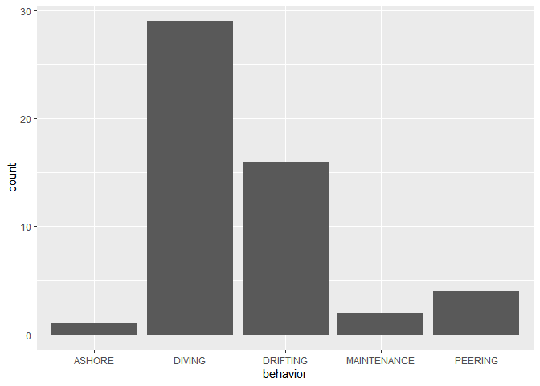
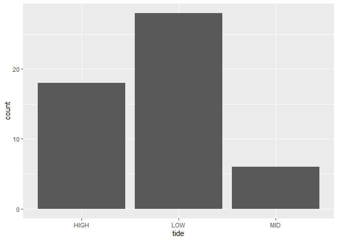

Common Loon Data Tidying
================
Ellie Gabrielson, Will Draxler, Autumn Pauly

# Loading the Packages and Data

``` r
library(tidyverse)
```

    ## ── Attaching core tidyverse packages ──────────────────────── tidyverse 2.0.0 ──
    ## ✔ dplyr     1.1.2     ✔ readr     2.1.4
    ## ✔ forcats   1.0.0     ✔ stringr   1.5.0
    ## ✔ ggplot2   3.4.2     ✔ tibble    3.2.1
    ## ✔ lubridate 1.9.2     ✔ tidyr     1.3.0
    ## ✔ purrr     1.0.1     
    ## ── Conflicts ────────────────────────────────────────── tidyverse_conflicts() ──
    ## ✖ dplyr::filter() masks stats::filter()
    ## ✖ dplyr::lag()    masks stats::lag()
    ## ℹ Use the conflicted package (<http://conflicted.r-lib.org/>) to force all conflicts to become errors

``` r
library(lubridate)
```

# Loading Data - 2023

``` r
#2023
all_bird_untidy_2023 <- read_csv("loons_2023.csv")
```

    ## Rows: 577 Columns: 33
    ## ── Column specification ────────────────────────────────────────────────────────
    ## Delimiter: ","
    ## chr  (19): date, tide, cal, location, species, latitude, longitude, meters_o...
    ## dbl  (12): year, month, day, tide_percentage, number, temperature, wind_spee...
    ## lgl   (1): shelter_gradient
    ## time  (1): time
    ## 
    ## ℹ Use `spec()` to retrieve the full column specification for this data.
    ## ℹ Specify the column types or set `show_col_types = FALSE` to quiet this message.

``` r
loons_2023 <- read_csv("loons_2023.csv")
```

    ## Rows: 577 Columns: 33
    ## ── Column specification ────────────────────────────────────────────────────────
    ## Delimiter: ","
    ## chr  (19): date, tide, cal, location, species, latitude, longitude, meters_o...
    ## dbl  (12): year, month, day, tide_percentage, number, temperature, wind_spee...
    ## lgl   (1): shelter_gradient
    ## time  (1): time
    ## 
    ## ℹ Use `spec()` to retrieve the full column specification for this data.
    ## ℹ Specify the column types or set `show_col_types = FALSE` to quiet this message.

``` r
#2024
loons_2024 <- read_csv("loons_2024.csv")
```

    ## Rows: 775 Columns: 31
    ## ── Column specification ────────────────────────────────────────────────────────
    ## Delimiter: ","
    ## chr  (19): date, tide, location, species, latitude, behavior, sex, behavior_...
    ## dbl  (11): number, longitude, meters_offshore, temperature, wind_speed, baro...
    ## time  (1): time
    ## 
    ## ℹ Use `spec()` to retrieve the full column specification for this data.
    ## ℹ Specify the column types or set `show_col_types = FALSE` to quiet this message.

# Tidying the Data

## Exposure

``` r
#assigning exposure level to locations
loons_2023 <- loons_2023 %>% 
  mutate(shelter_gradient = case_when(location == "BAR HARBOR PIER" ~ "exposed",
                                      location == "SEAL HARBOR BEACH" ~ "moderate",
                                      location == "BRACY HARBOR" ~ "moderate",
                                      location == "NORTHEAST HARBOR" ~ "moderately_sheltered",
                                      location == "SOMES SOUND" ~ "sheltered",
                                      location == "SOUTHWEST HARBOR" ~ "moderately_sheltered",
                                      location == "SEAWALL" ~ "exposed",
                                      location == "SEAL COVE" ~ "moderately_exposed",
                                      location == "SAND BEACH" ~ "moderately_exposed"))
 
#releveling the exposure levels from most exposed to least exposed 
shelter_factor <- fct_relevel(loons_2023$shelter_gradient, c(
                "exposed", 
                "moderately_exposed",
                "moderate",
                "moderately_sheltered",
                "sheltered"))

#saving a dataset to include only loons and the shelter factor
loons_2023 <- loons_2023 %>% 
  mutate(shelter_factor = shelter_factor) %>% 
  filter(species == "COMMON LOON")

#counting how many different exposure observations we have
loons_2023 %>% 
  count(shelter_factor)
```

    ## # A tibble: 5 × 2
    ##   shelter_factor           n
    ##   <fct>                <int>
    ## 1 exposed                 48
    ## 2 moderately_exposed      33
    ## 3 moderate                29
    ## 4 moderately_sheltered    17
    ## 5 sheltered                4

## Changing `chr` variables to `num`

There are a number of variables within this dataset that are character
variables that should be numeric variables (i.e. meters_offshore,
longitude, latitude)

``` r
#Change character numbers to numeric
loons_2023 <- loons_2023 %>% 
  mutate(meters_offshore = as.numeric(meters_offshore)) %>% 
  mutate(latitude = as.numeric(latitude)) %>% 
  mutate(longitude = as.numeric(longitude)) %>% 
  mutate(barometer = as.numeric(barometer)) %>% 
  mutate(date = as_date(date, format = "%m/%d/%Y")) %>% 
  mutate(time = hms::as_hms(time)) %>% 
  select(-year, -day, -month)
```

    ## Warning: There was 1 warning in `mutate()`.
    ## ℹ In argument: `barometer = as.numeric(barometer)`.
    ## Caused by warning:
    ## ! NAs introduced by coercion

``` r
glimpse(loons_2023)
```

    ## Rows: 131
    ## Columns: 31
    ## $ date               <date> 2023-01-04, 2023-01-04, 2023-01-04, 2023-01-04, 20…
    ## $ time               <time> 14:20:00, 14:20:00, 14:20:00, 14:20:00, 14:50:00, …
    ## $ tide_percentage    <dbl> 0, 0, 0, 0, 0, 0, 0, 0, 50, 50, 50, 60, 60, 60, 60,…
    ## $ tide               <chr> "LOW", "LOW", "LOW", "LOW", "LOW", "LOW", "LOW", "L…
    ## $ cal                <chr> "LOW EBB", "LOW EBB", "LOW EBB", "LOW EBB", "LOW", …
    ## $ location           <chr> "BAR HARBOR PIER", "BAR HARBOR PIER", "BAR HARBOR P…
    ## $ species            <chr> "COMMON LOON", "COMMON LOON", "COMMON LOON", "COMMO…
    ## $ number             <dbl> 1, 1, 1, 1, 1, 1, 1, 1, 1, 1, 1, 1, 1, 1, 1, 1, 1, …
    ## $ latitude           <dbl> 44.39161, 44.39124, 44.39107, 44.39105, 44.29530, 4…
    ## $ longitude          <dbl> -68.20366, -68.20303, -68.20228, -68.20255, -68.239…
    ## $ meters_offshore    <dbl> 50, 37, 18, 16, 15, 450, 440, 300, 100, 30, 30, 153…
    ## $ behavior           <chr> "PEERING", "DIVING", "DRIFTING", "DRIFTING", "DIVIN…
    ## $ behavior_notes     <chr> NA, NA, NA, NA, NA, NA, NA, NA, NA, NA, NA, NA, NA,…
    ## $ sky_condition      <chr> "CLOUDY, WINDY", "CLOUDY, WINDY", "CLOUDY, WINDY", …
    ## $ weather_notes      <chr> NA, NA, NA, NA, NA, NA, NA, NA, NA, NA, NA, NA, NA,…
    ## $ precipitation      <chr> "NONE", "NONE", "NONE", "NONE", "NONE", "NONE", "NO…
    ## $ temperature        <dbl> 42.5, 42.5, 42.5, 42.5, 42.7, 42.0, 42.0, 42.0, 32.…
    ## $ wind_speed         <dbl> 2.0, 2.0, 2.0, 2.0, 2.4, 2.0, 2.0, 2.0, 5.0, 5.0, 5…
    ## $ wind_direction     <chr> "NNE", "NNE", "NNE", "NNE", "NNE", "NNE", "NNE", "N…
    ## $ barometer          <dbl> 29.98, 29.98, 29.98, 29.98, 29.98, 29.98, 29.98, 29…
    ## $ humidity           <dbl> 88, 88, 88, 88, 88, 88, 88, 88, 97, 97, 97, 97, 97,…
    ## $ cloud_coverage     <dbl> 100, 100, 100, 100, 75, 60, 60, 60, 100, 100, 100, …
    ## $ wave_class         <dbl> 1.0, 1.0, 1.0, 1.0, 2.0, 2.0, 2.0, 2.0, 3.0, 3.0, 3…
    ## $ human_activity     <chr> "CONSTRUCTION", "CONSTRUCTION", "CONSTRUCTION", "CO…
    ## $ water_activity     <chr> "NONE", "NONE", "NONE", "NONE", "NONE", "NONE", "NO…
    ## $ shelter_gradient   <chr> "exposed", "exposed", "exposed", "exposed", "modera…
    ## $ notes              <chr> NA, NA, NA, NA, NA, NA, NA, NA, NA, NA, NA, NA, NA,…
    ## $ moon_phase         <chr> "WAXING GIBBOUS", "WAXING GIBBOUS", "WAXING GIBBOUS…
    ## $ overall_abundance  <dbl> 8, 8, 8, 8, 8, 8, 8, 8, 7, 7, 7, 7, 7, 7, 7, 4, 4, …
    ## $ specific_abundance <dbl> 4, 4, 4, 4, 1, 3, 3, 3, 3, 3, 3, 3, 3, 3, 1, 1, 2, …
    ## $ shelter_factor     <fct> exposed, exposed, exposed, exposed, moderate, moder…

## Location

``` r
#determining how many locations we have
unique(loons_2023$location)
```

    ## [1] "BAR HARBOR PIER"   "SEAL HARBOR BEACH" "BRACY HARBOR"     
    ## [4] "NORTHEAST HARBOR"  "SOMES SOUND"       "SOUTHWEST HARBOR" 
    ## [7] "SEAWALL"           "SEAL COVE"         "SAND BEACH"

## Behavior

``` r
unique(loons_2023$behavior)
```

    ## [1] "PEERING"     "DIVING"      "DRIFTING"    "MAINTENANCE" "ASHORE"

``` r
#Count occurence of behaviors
loons_2023_behavior <- loons_2023 %>% 
  filter(species == "COMMON LOON") %>% 
  group_by(date, behavior, species, tide, tide_percentage) %>% 
  count(behavior)

loons_2023_behavior
```

    ## # A tibble: 52 × 6
    ## # Groups:   date, behavior, species, tide, tide_percentage [52]
    ##    date       behavior    species     tide  tide_percentage     n
    ##    <date>     <chr>       <chr>       <chr>           <dbl> <int>
    ##  1 2023-01-04 DIVING      COMMON LOON LOW                 0     4
    ##  2 2023-01-04 DRIFTING    COMMON LOON LOW                 0     2
    ##  3 2023-01-04 MAINTENANCE COMMON LOON LOW                 0     1
    ##  4 2023-01-04 PEERING     COMMON LOON LOW                 0     1
    ##  5 2023-01-06 DIVING      COMMON LOON MID                50     3
    ##  6 2023-01-06 DIVING      COMMON LOON MID                60     4
    ##  7 2023-01-08 DIVING      COMMON LOON HIGH               90     3
    ##  8 2023-01-08 DRIFTING    COMMON LOON HIGH               90     1
    ##  9 2023-01-12 DIVING      COMMON LOON LOW                 0     3
    ## 10 2023-01-12 DIVING      COMMON LOON LOW                10     2
    ## # ℹ 42 more rows

``` r
#Count the occurrences of behavior of loons
ggplot(data = loons_2023_behavior, mapping = aes(x = behavior)) + 
  geom_bar()
```

<!-- -->

``` r
#Count how many low, high, and mid tide observations we have
ggplot(data = loons_2023_behavior, mapping = aes(x = tide)) + 
  geom_bar()
```

<!-- -->
